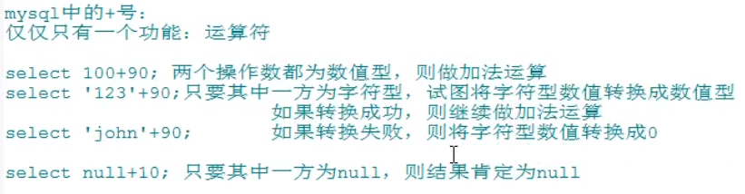

# SQL原理及优化

SQL原理及优化

本Repo主要是学习

[B站诸葛大佬的视频](https://www.bilibili.com/video/BV1xh411Z79d?from=search&seid=13825300358552977702)

[github mysql C++源码](https://github.com/mysql/mysql-server)

[B站李玉婷老师的基础课程](https://www.bilibili.com/video/BV12b411K7Zu?p=12)

记笔记，写代码，做心得总结

## P1&P2&P3&P4 

**索引**是帮助MySQL高效获取数据的排好序的数据结构

**索引数据结构：**

**二叉树**

**红黑树**

**Hash表**

**B-Tree**

MySql早期有尝试过二叉树数据结构，但是二叉树在最差的情况下，已经退化成链表了，复杂度直接O(n)

红黑树是二叉平衡树，相对于二叉树更优，但是平衡消耗也会比较大,而且树的高度也会很高...

最后MySql用的是B+树(多路平衡树)，为什么呢？因为对于查找来说，控制树的高度对于效率很重要，多点横向结点能存储更多的元素就可以了...

数据库查询：比如上图所示，要查找select \* from T where T.col = 20

由于数据表是存储在磁盘上的，所以在对B+树进行查找的时候，首先会进行IO操作，把根节点加载到内存(RAM)中，然后对内存进行查找

接下来会继续进入到第二层左边的结点，再继续到索引20，找到下面的data。

磁盘IO会比较耗费时间，但是内存中查找会很快很快，可以忽略不计。

一层结点用16KB。这是MySql内部实现的，具体可以看MySQL源码，当然用户也可以自己去调整大小。可以看如下图：

其实在真实的MySql中，是把非叶子结点都直接放在内存中的，因为非叶子结点都是存放索引，不会占用太大空间...也就是真实的MySQL经过一两次的磁盘IO就能够搞定搜索。

>结合具体的实践例子来看：

Navicat Premium 软件 和MySQL安装参考blog：

**存储引擎(形容表的)...**

所以我们可以来看看HashTable实现的结构是啥样的：

B+树和B树的区别：

## P5&P6

MySQL有很多优化原则~

**联合索引-索引最左前缀原理：**

如下三条语句，哪个语句会走索引？

答案是第一条，从底层数据结构去考虑，因为age、position不是排好序的，在search的时候还是会全表扫描...

## P10&P11

深入理解MySQL锁与事务隔离级别~

MVCC机制详解：

MVCC主要是为了提高并发的读写性能，不用加锁就能让多个事务并发读写。

# 基础回笼

DB：Daba base,数据库

DBMS：Data Base Management System，数据库管理系统，比如MySQL软件，Oracle软件

可以把表的每一列理解成类中的属性，把表的每一行理解成类对象~(以前从来没这么想过，现在想想感觉：对啊！)

显示表结构：

>DESC departments；

查询去重**DISTINCT**：

>SELECT DISTINCT department_id FROM emplyees;

连接函数**CONCAT**

>SELECT CONCAT(last_name,first_name) as 姓名 FROM emplyees;

众所周知，在java或者C++的运算符重载中，+号一般有两个作用：

1、数值相加，数学运算

2、字符串拼接

但是在MYSQL中的+，是如下情况：

MySQL逻辑条件查询不多写了，太简单了，这里写一写模糊查询，(通配符)：

1、like

>查询员工名中包含字符a的员工信息

>SELECT \* FROM emplyees WHERE last_name LIKE '%a%';

>查询员工名中第3个字符e,第5个字符为a的员工名和工资

>SELECT last_name,salary FROM emplyees WHERE last_name LIKE '__e_a%';

转义的话，依然是\，当然用ESCAPE来声明这个字符是转义符

>查询员工名中第二个字符为_的员工名

>SELECT last_name FROM emplyees WHERE last_name LIKE '_$_%' ESCAPE '$';

2、between and （包含临界值）

>查询员工编号在100到120之间的员工信息

>SELECT \* FROM emplyees WHERE emplyee_id BETWEEN 100 AND 120;

3、in

>查询员工的工种编号是 IT_PROG、AD_VP、AD_PRES中的一个员工名和工种编号

>SELECT last_name,job_id FROM emplyees WHERE job_id IN ('IT_PROT','AD_VP','AD_PRES');

4、is null

>查询没有奖金的员工名和奖金率

>SELECT last_name,commission_pct FROM emplyees WHERE commission_pct IS NULL;

5、安全等于<=>

>查询没有奖金的员工名和奖金率

>SELECT last_name,commission_pct FROM emplyees WHERE commission_pct <=> NULL;

>查询工资为12000的员工信息

>SELECT last_name,commission_pct FROM emplyees WHERE salary <=> 12000;

通配符：

% 任意多个字符，包含0个字符

_ 任意单个字符

事务是数据库操作的最小逻辑工作单元，是一系列SQL(structure query language)操作的集合.

**事务具有ACID特性：原子性、一致性、隔离性和持久性。**

提交(commit transaction)：使事务成功地结束，所执行事务对数据库的所有更新将永远存在。

回滚(rollback transaction)：即在事务的运行过程中发生了某种故障，事务不能继续运行，影响该事务的SQL语句所造成的任何改变必须全部作废，回滚到事务开始前的状态。

其实提交和回滚特别像svn操作中的commit和revert...

并发操作的三类问题：

1、丢失更新：写写冲突，加排他锁X

2、读“脏”数据：写读冲突，加共享锁S

3、不可重复读：读写冲突

