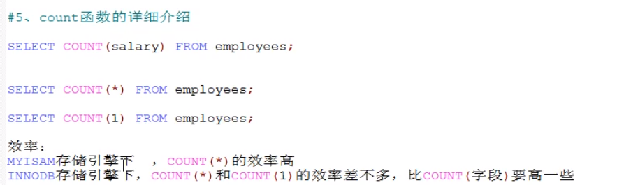
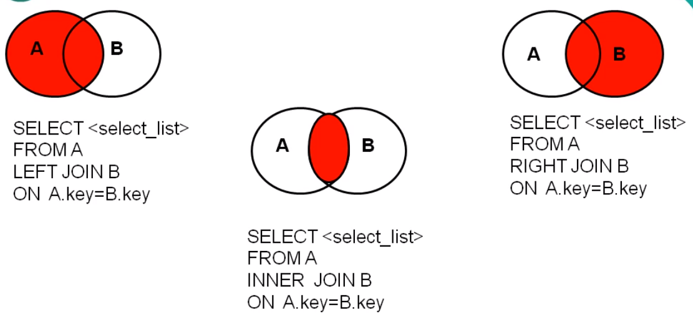
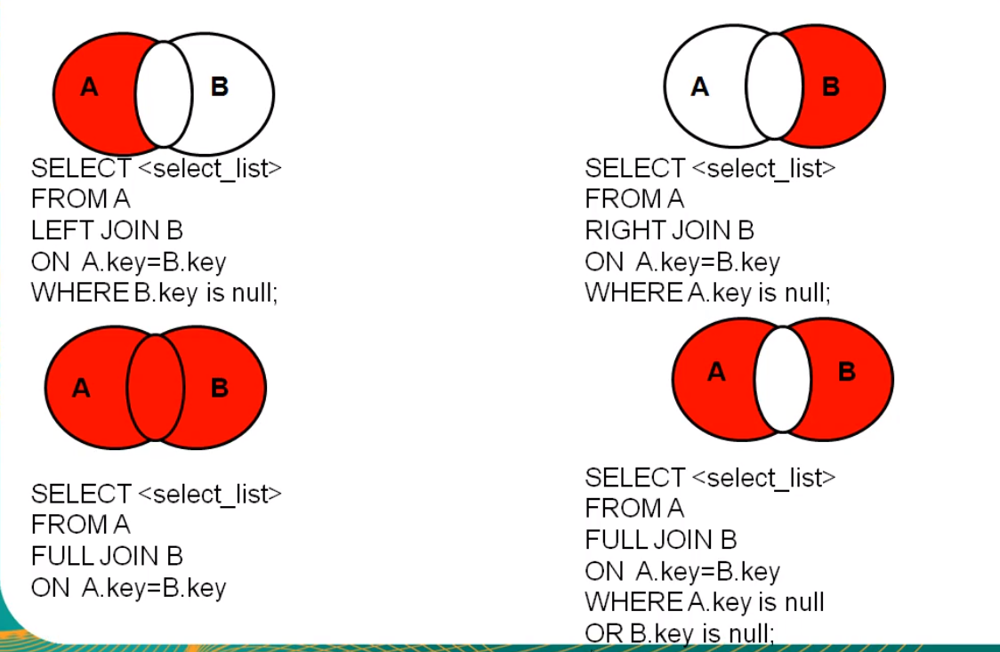

# SQL原理及优化

SQL原理及优化

本Repo主要是学习

[B站诸葛大佬的视频](https://www.bilibili.com/video/BV1xh411Z79d?from=search&seid=13825300358552977702)

[github mysql C++源码](https://github.com/mysql/mysql-server)

[B站李玉婷老师的基础课程](https://www.bilibili.com/video/BV12b411K7Zu?p=12)

记笔记，写代码，做心得总结

这次MYSQL学习，真的让我明白了，为啥字符串/文件操作/树/链表/排序算法这些基础知识这么重要...

## P1&P2&P3&P4 

**索引**是帮助MySQL高效获取数据的排好序的数据结构

**索引数据结构：**

**二叉树**

**红黑树**

**Hash表**

**B-Tree**

MySql早期有尝试过二叉树数据结构，但是二叉树在最差的情况下，已经退化成链表了，复杂度直接O(n)

红黑树是二叉平衡树，相对于二叉树更优，但是平衡消耗也会比较大,而且树的高度也会很高...

最后MySql用的是B+树(多路平衡树)，为什么呢？因为对于查找来说，控制树的高度对于效率很重要，多点横向结点能存储更多的元素就可以了...

数据库查询：比如上图所示，要查找select \* from T where T.col = 20

由于数据表是存储在磁盘上的，所以在对B+树进行查找的时候，首先会进行IO操作，把根节点加载到内存(RAM)中，然后对内存进行查找

接下来会继续进入到第二层左边的结点，再继续到索引20，找到下面的data。

磁盘IO会比较耗费时间，但是内存中查找会很快很快，可以忽略不计。

一层结点用16KB。这是MySql内部实现的，具体可以看MySQL源码，当然用户也可以自己去调整大小。可以看如下图：

其实在真实的MySql中，是把非叶子结点都直接放在内存中的，因为非叶子结点都是存放索引，不会占用太大空间...也就是真实的MySQL经过一两次的磁盘IO就能够搞定搜索。

>结合具体的实践例子来看：

Navicat Premium 软件 和MySQL安装参考blog：

**存储引擎(形容表的)...**

所以我们可以来看看HashTable实现的结构是啥样的：

B+树和B树的区别：

## P5&P6

MySQL有很多优化原则~

**联合索引-索引最左前缀原理：**

如下三条语句，哪个语句会走索引？

答案是第一条，从底层数据结构去考虑，因为age、position不是排好序的，在search的时候还是会全表扫描...

## P10&P11

深入理解MySQL锁与事务隔离级别~

MVCC机制详解：

MVCC主要是为了提高并发的读写性能，不用加锁就能让多个事务并发读写。

# 基础回笼

这个有相关pdf，所以请查看pdf资源~没必要看我碎碎念(我也放弃碎碎念了)...因为婷姐的这个基础MySQL，给的资源实在是太到位了...

## 概念

DB：Daba base,数据库

DBMS：Data Base Management System，数据库管理系统，比如MySQL软件，Oracle软件

可以把表的每一列理解成类中的属性，把表的每一行理解成类对象~(以前从来没这么想过，现在想想感觉：对啊！)

显示表结构：

>DESC departments；

查询去重**DISTINCT**：

>SELECT DISTINCT department_id FROM emplyees;

连接函数**CONCAT**

>SELECT CONCAT(last_name,first_name) as 姓名 FROM emplyees;

众所周知，在java或者C++的运算符重载中，+号一般有两个作用：

1、数值相加，数学运算

2、字符串拼接

但是在MYSQL中的+，是如下情况：

## 模糊查询

MySQL逻辑条件查询不多写了，太简单了，这里写一写***模糊查询**，(通配符)：

1、like

>查询员工名中包含字符a的员工信息

>SELECT \* FROM emplyees WHERE last_name LIKE '%a%';

>查询员工名中第3个字符e,第5个字符为a的员工名和工资

>SELECT last_name,salary FROM emplyees WHERE last_name LIKE '__e_a%';

转义的话，依然是\，当然用ESCAPE来声明这个字符是转义符

>查询员工名中第二个字符为_的员工名

>SELECT last_name FROM emplyees WHERE last_name LIKE '_$_%' ESCAPE '$';

2、between and （包含临界值）

>查询员工编号在100到120之间的员工信息

>SELECT \* FROM emplyees WHERE emplyee_id BETWEEN 100 AND 120;

3、in

>查询员工的工种编号是 IT_PROG、AD_VP、AD_PRES中的一个员工名和工种编号

>SELECT last_name,job_id FROM emplyees WHERE job_id IN ('IT_PROT','AD_VP','AD_PRES');

4、is null

>查询没有奖金的员工名和奖金率

>SELECT last_name,commission_pct FROM emplyees WHERE commission_pct IS NULL;

5、安全等于<=>

>查询没有奖金的员工名和奖金率

>SELECT last_name,commission_pct FROM emplyees WHERE commission_pct <=> NULL;

>查询工资为12000的员工信息

>SELECT last_name,commission_pct FROM emplyees WHERE salary <=> 12000;

>查询员工职位不是IT的信息

>SELECT \* FROM emplyees WHERE job_id <> 'IT'

通配符：

% 任意多个字符，包含0个字符

_ 任意单个字符

%% 不包含NULL

## 排序查询

>查询员工信息，要求工资从高到低排序

>SELECT \* FROM emplyees ORDER BY salary DESC;

>查询部门编号>=90的员工信息，按入职时间先后进行排序

>SELECT \* FROM emplyees WHERE department_id >= 90 ORDER BY hiredate ASC;

>查询员工信息，要求先按工资升序，再按员工编号降序【多字段排序】

>SELECT \* FROM emplyees ORDER BY salary ASC,emplyee_id DESC;

**常见函数：**

字符函数：

LENGTH()/CONCAT()/UPPER()/LOWER()

SUBSTR()-MySQL中索引是从1开始/INSTR()-返回索引

trim()-去掉前后某些字符/lpad()-指定字符实现左填充指定长苏/REPLACE()

>姓名中首字符大写，其他字符小写然后用_拼接，显示出来

>SELECT CONCAT(UPPER(SUBSTR(last_name,1,1)),'_',LOWER(SUBSTR(last_name,2))) out_put FROM emplyees;

数学函数：

ROUND()-四舍五入/CEIL()-向上取整/FLOOR-向下取整

TRUNCATE()-截断/MOD()-取余

日期函数：

NOW()/CURDATE()/CURTIME()/STR_TO_DATE()/

流程控制函数：

if()/case when then

分组函数：

SUM()/AVG()/MAX()/MIN()/COUNT()

## 分组查询

>查询每个工种的最高工资

>SELECT MAX(salary),job_id FROM emplyees GROUP BY job_id;

>查询每个位置上的部门个数

>SELECT COUNT(\*),location_id FROM departments GROUP BY location_id;

>查询每个领导手下有奖金的员工的最高工资

>SELECT MAX(salary),manager_id FROM emplyees WHERE commission_pct IS NOT NULL GROUP BY manager_id;

>查询哪个部门的员工个数>2

>SELECT COUNT(\*),department_id FROM emplyees GROUP BY department_id HAVING COUNT(\*)>2;

**WHERE过滤行,在分组前执行，HAVING过滤分组后结果,在分组后执行**

**分组函数做条件肯定放在HAVING字句中，WHERE是表中的字段**

>查询每个工种有奖金的员工的最高工资>12000的工种编号和最高工资

>SELECT MAX(salary),job_id FROM emplyees WHERE commission_pct IS NOT NULL GROUP BY job_id HAVING MAX(salary)>12000;

>查询领导编号>102的每个领导手下的最低工资>5000的领导编号是哪个，以及其最低工资

>SELECT MIN(salary),manager_id FROM emplyees WHERE manager_id>102 GROUP BY manager_id HAVING MIN(salary)>5000;

>按员工姓名的长度分组，查询每一组的员工个数，筛选员工个数>5的有哪些

>SELECT COUNT(\*),LENGTH(last_name) len_name FROM emplyees GROUP BY LENGTH(last_name) HAVING COUNT(*)>5;

>查询每个部门每个工种的员工的平均工资

>SELECT AVG(salary),department_id,job_id FROM emplyees GROUP BY job_id,department_id;

>查询每个部门每个工种的员工平均工资大于10000的平均工资，并且按平均工资的高低显示

>SELECT AVG(salary),department_id,job_id FROM emplyees WHERE department_id IS NOT NULL GROUP BY job_id,department_id HAVING AVG(salary)>10000 ORDER BY AVG(salary) DESC;

## 连接查询

按功能分类：

内连接：等值连接/非等值连接/自连接

外连接：左外连接/右外连接/全外连接

交叉连接：~

等值连接

>查询女神名和对应的男神名

>SELECT NAME,boyName FROM boys,beauty WHERE beauty.boyfriend_id = boys.id;

>查询员工名和对应的部门名

>SELECT last_name,department_name FROM emplyees,departments WHERE department_id = departments.department_id;

>查询有奖金的员工名、部门名

>SELECT last_name,department_name,commission_pct FROM emplyees e,departments d WHERE e.department_id=d.department_id AND e.commission_pct IS NOT NULL;

非等值连接

>查询员工的工资和工资级别

>SELECT salary,grade_level FROM emplyees e,job_grades g WHERE salary BETWEEN g.lowest_sal AND g.highest_sal;

自连接

>查询员工名和上级的名称

>SELECT e.emplyee_id,e.last_name,m.emplyee_id,m.last_name FROM emplyees e,emplyees m WHERE e.manager_id=m.emplyee_id;

或者

>SELECT e.last_name,m.last_name FROM emplyees e JOIN emplyees m ON e.manager_id=m.emplyee_id;

外连接-用于查询一个表中有，另一个表中没有的情况：

外连接查询结果 = 内连接结果+主表中有而从表中没有的记录

外连接的查询结果为主表中的所有记录，如果从表中有和它匹配的，则显示匹配的值；如果从表中没有和它匹配的，则显示null

左外连接，left join 左边的是主表
右外连接，right join 右边的是主表

全外连接

>USE girls;

>SELECT b.\*,bo.\* FROM beauty b FULL OUTER JOIN boys bo ON b.boyfriend_id = bo.id;

全外连接 = 内连接结果+表1中有但表2中没有+表2中有但表1中没有的

交叉连接(笛卡尔乘积)

## 子查询

出现在其他语句中的select语句，成为子查询或内查询

外部的查询语句，称为主查询或外查询

## 事务

事务是数据库操作的最小逻辑工作单元，是一系列SQL(structure query language)操作的集合.

**事务具有ACID特性：原子性、一致性、隔离性和持久性。**

提交(commit transaction)：使事务成功地结束，所执行事务对数据库的所有更新将永远存在。

回滚(rollback transaction)：即在事务的运行过程中发生了某种故障，事务不能继续运行，影响该事务的SQL语句所造成的任何改变必须全部作废，回滚到事务开始前的状态。

其实提交和回滚特别像svn操作中的commit和revert...

## 锁

并发操作的三类问题：

1、丢失更新：写写冲突，加排他锁X

2、读“脏”数据：写读冲突，加共享锁S

3、不可重复读：读写冲突

