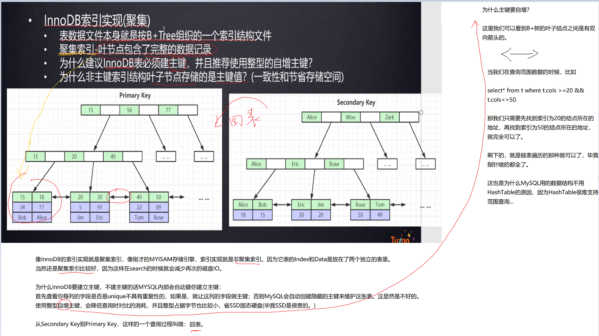

# SQL原理及优化

SQL原理及优化

本Repo主要是学习[B站诸葛大佬的视频](https://www.bilibili.com/video/BV1xh411Z79d?from=search&seid=13825300358552977702)

记笔记，写代码，做心得总结

# P1&P2&P3&P4 

**索引**是帮助MySQL高效获取数据的排好序的数据结构

**索引数据结构：**

**二叉树**

**红黑树**

**Hash表**

**B-Tree**

MySql早期有尝试过二叉树数据结构，但是二叉树在最差的情况下，已经退化成链表了，复杂度直接O(n)

红黑树是二叉平衡树，相对于二叉树更优，但是平衡消耗也会比较大,而且树的高度也会很高...

最后MySql用的是B+树(多路平衡树)，为什么呢？因为对于查找来说，控制树的高度对于效率很重要，多点横向结点能存储更多的元素就可以了...

数据库查询：比如上图所示，要查找select \* from T where T.col = 20

由于数据表是存储在磁盘上的，所以在对B+树进行查找的时候，首先会进行IO操作，把根节点加载到内存(RAM)中，然后对内存进行查找

接下来会继续进入到第二层左边的结点，再继续到索引20，找到下面的data。

磁盘IO会比较耗费时间，但是内存中查找会很快很快，可以忽略不计。

一层结点用16KB。这是MySql内部实现的，具体可以看MySQL源码，当然用户也可以自己去调整大小。可以看如下图：

其实在真实的MySql中，是把非叶子结点都直接放在内存中的，因为非叶子结点都是存放索引，不会占用太大空间...也就是真实的MySQL经过一两次的磁盘IO就能够搞定搜索。

>结合具体的实践例子来看：

Navicat Premium 软件 和MySQL安装参考blog：

**存储引擎(形容表的)...**

所以我们可以来看看HashTable实现的结构是啥样的：

B+树和B树的区别：

# P5&P6

MySQL有很多优化原则~

**联合索引-索引最左前缀原理：**

如下三条语句，哪个语句会走索引？

答案是第一条，从底层数据结构去考虑，因为age、position不是排好序的，在search的时候还是会全表扫描...

